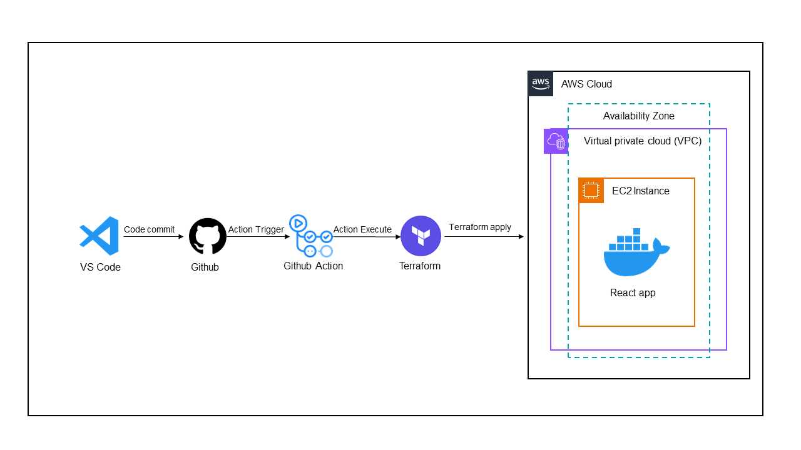

# Deploying React App on AWS EC2 with Dockerization


## Overview



This repository contains all the necessary files and configurations to deploy a React application on an AWS EC2 instance using Docker. The deployment process is automated using Terraform for infrastructure provisioning and GitHub Actions for continuous integration and deployment (CI/CD).

## Features
- **React Application**: Deploy a React app built with the latest industry standards.
- **Dockerization**: Containerize the React application for consistent and scalable deployment.
- **AWS EC2**: Launch an EC2 instance to host the Docker container.
- **Terraform**: Use Terraform to manage and provision AWS infrastructure.
- **GitHub Actions**: Automate the deployment process using GitHub Actions for CI/CD.

## Prerequisites

- [Docker](https://www.docker.com/products/docker-desktop) installed on your local machine.
- [Terraform](https://www.terraform.io/downloads.html) installed on your local machine.
- AWS account with sufficient permissions to create and manage EC2 instances.
- GitHub account for accessing the repository and configuring GitHub Actions.

## Getting Started

### Clone the Repository

First, clone the repository to your local machine:

```bash
git clone https://github.com/adil6572/deploying-react-app-aws.git
cd deploying-react-app-aws
```

### Configure AWS Credentials

Ensure your AWS credentials are configured properly. You can use the AWS CLI to configure your credentials:

```bash
aws configure
```

### Build and Push Docker Image

1. **Login to Docker Hub**: Make sure you are logged into your Docker Hub account.

    ```bash
    docker login
    ```

2. **Build the Docker Image**: Build the Docker image for your React application.

    ```bash
    docker build -t your-docker-username/your-image-name:latest .
    ```

3. **Push the Docker Image**: Push the Docker image to Docker Hub.

    ```bash
    docker push your-docker-username/your-image-name:latest
    ```

### Initialize Terraform

Navigate to the `terraform` directory, initialize the Terraform working directory, and download necessary providers:

```bash
cd terraform
terraform init
```

### Plan and Apply Terraform Configuration

Review the Terraform plan and apply the configuration to provision the AWS resources:

```bash
terraform plan
terraform apply --auto-approve
```

### GitHub Actions CI/CD

The repository includes a GitHub Actions workflow for automating the Docker build, push, and Terraform deployment. To enable this, ensure the following secrets are configured in your GitHub repository:

- `AWS_ACCESS_KEY`
- `AWS_SECRET_ACCESS_KEY`
- `DOCKER_USERNAME`
- `DOCKER_PASSWORD`

The workflow file is located at `.github/workflows/deploy.yml`.

### Update Workflow and Terraform Files

Make sure to update the Docker image name in both the GitHub Actions workflow and the Terraform configuration files to match your Docker Hub repository:

- In the workflow file `.github/workflows/react-deploy.yml`, update the image name in the Docker build and push steps:

    ```yaml
    - name: Build and push Docker image
      run: |
        docker build -t your-docker-username/your-image-name:latest .
        docker push your-docker-username/your-image-name:latest
    ```

- In your Terraform files, update the image name wherever the Docker image is referenced `terraform/main.tf`:

    ```hcl
  user_data = <<-EOF
              #!/bin/bash
              sudo apt-get update -y
              sudo apt-get install -y docker.io
              sudo systemctl start docker
              sudo systemctl enable docker
              sudo docker pull your-docker-username/your-image-name:latest
              sudo docker run -d -p 80:80 your-docker-username/your-image-name:latest
              EOF
  
  ```

Replace `your-docker-username/your-image-name` with your actual Docker Hub username and the name of your Docker image.

## Contributing

Contributions are welcome! Please open an issue or submit a pull request for any changes or improvements.

## License

This project is licensed under the MIT License. See the [LICENSE](LICENSE) file for details.
